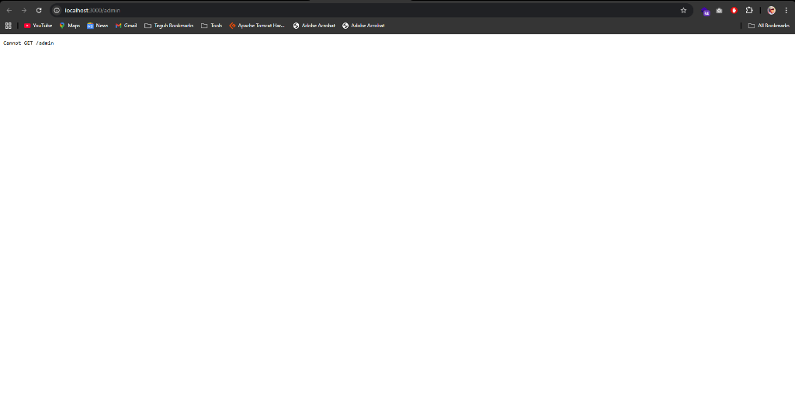

# TNCP Portfolio & Digital Marketplace v2.0



Sebuah platform portfolio professional, marketplace source code, dan hub artikel IT yang dibangun dengan pendekatan **Static First** dan desain **Premium SaaS (Figma Trend 2026)**.

## ✨ Fitur Unggulan
- **Modern UI/UX**: Menggunakan Glassmorphism, Mesh Gradients, dan micro-animations.
- **Static Site Ready**: Dapat dideploy langsung ke GitHub Pages tanpa perlu database/backend server.
- **WhatsApp Checkout**: Integrasi keranjang belanja modern yang terhubung langsung ke WhatsApp untuk transaksi.
- **Enterprise CMS (Local Only)**: Panel admin berbasis AdminLTE yang telah dimodernisasi untuk mengelola data via JSON secara lokal.
- **Knowledge Sharing**: Section artikel yang elegan untuk membagikan wawasan teknis.
- **Mobile Responsive**: Optimal di berbagai ukuran layar (pills, menu, dan layout).

## 🛠️ Tech Stack
- **Frontend**: HTML5, Tailwind CSS, Lucide Icons, Vanilla JavaScript.
- **Local Editor (Backend)**: Node.js, Express, EJS, AdminLTE (Flat-file JSON system).
- **Branding**: Font Outfit & Space Grotesk.

## 🚀 Cara Menjalankan Secara Lokal
Jika Anda ingin menambahkan atau mengedit konten melalui Panel Admin:

1. Pastikan Node.js sudah terinstall.
2. Clone repository ini.
3. Jalankan perintah:
   ```bash
   node server.js
   ```
4. Akses Dashboard Admin di: `http://localhost:3000/login`
   - **User**: `admin`
   - **Pass**: `admin123`

## 📦 Cara Deploy ke GitHub Pages
Website ini dirancang untuk berjalan statis. Cukup push file berikut ke repository Anda:
- `index.html`
- `app.js`
- `logo.png`
- Folder `data/` (berisi JSON)

Kemudian aktifkan GitHub Pages pada branch `main`.

## 📂 Struktur Folder
```text
├── index.html          # Entry point utama (Statis)
├── app.js              # Logic frontend & renderer
├── logo.png            # Asset Branding
├── data/               # Database Flat-file (JSON)
│   ├── projects.json
│   └── articles.json
├── server.js           # Local Editor Server (Node.js)
├── views/              # Template Dashboard Admin (EJS)
└── public/             # Assets & Local Development
```

---
Dibuat dengan ❤️ oleh **TNCP**.
